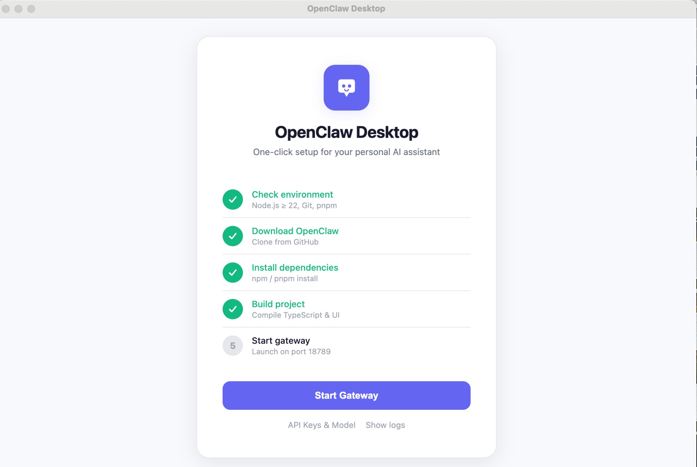
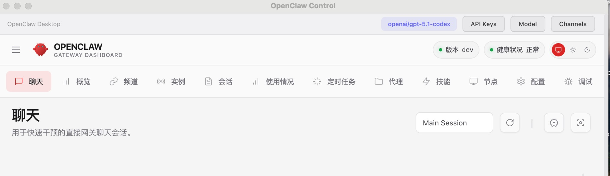

# OpenClaw Desktop
!
One-click desktop launcher for [OpenClaw](https://github.com/openclaw/openclaw) — your personal AI assistant.

No command line needed. Download, configure, and run OpenClaw with a single click.

## Features

- **One-Click Setup** — Automatically downloads, installs, builds, and launches OpenClaw
- **Auto Update Detection** — Checks GitHub for new versions and prompts to update
- **API Key Management** — Configure keys for OpenAI, Anthropic, Google, DeepSeek, xAI, Doubao, and more
- **Model Selection** — Switch between GPT-5.1, Claude Opus 4.6, Gemini 3, Grok 4, DeepSeek R1, etc.
- **Channel Configuration** — Set up WhatsApp, Telegram, Discord, Slack, Feishu, and other messaging channels
- **Gateway Management** — Start, stop, and monitor the OpenClaw gateway from the system tray
- **Custom Install Path** — Choose where to download and install OpenClaw
- **Cross-Platform** — macOS (DMG), Windows (NSIS), Linux (AppImage/deb)
- **Dark Mode** — Follows system theme automatically

## Screenshots

### Setup Wizard

<p align="center">
  
</p>

### Control UI with Toolbar

<p align="center">
  
</p>

## Prerequisites

- **Node.js >= 22** — [Download](https://nodejs.org/)
- **Git** — [Download](https://git-scm.com/)
- **pnpm** — Install with `npm install -g pnpm`

## Quick Start

```bash
git clone https://github.com/your-username/openclaw-desktop.git
cd openclaw-desktop
npm install
npm run dev
```

## Development

```bash
# Install dependencies
npm install

# Build TypeScript
npm run build

# Run in development mode
npm run dev

# Run the built app
npm start
```

## Packaging

Build distributable packages for your platform:

```bash
# macOS DMG
npm run dist:mac

# Windows installer
npm run dist:win

# Linux AppImage + deb
npm run dist:linux

# All platforms
npm run dist
```

Output goes to the `release/` directory.

## Architecture

```
openclaw-desktop/
├── src/
│   ├── main.ts              # Electron main process — window, tray, menu, IPC
│   ├── preload.ts            # Secure IPC bridge (contextIsolation)
│   ├── openclaw-manager.ts   # Core logic — download, build, gateway lifecycle
│   ├── setup.html            # Setup wizard UI with progress tracking
│   ├── settings.html         # API key & model configuration UI
│   └── channels.html         # Messaging channel configuration UI
├── assets/                   # App icons (SVG + PNG)
├── package.json              # Dependencies & electron-builder config
└── tsconfig.json             # TypeScript configuration
```

### How It Works

```
┌─────────────────────────────────────────────┐
│              OpenClaw Desktop               │
│                                             │
│  1. Check environment (Node, Git, pnpm)     │
│  2. git clone openclaw/openclaw             │
│  3. pnpm install                            │
│  4. pnpm build + pnpm ui:build              │
│  5. Start gateway (node openclaw.mjs)       │
│  6. Inject auth token into Control UI       │
│  7. Load Control UI in Electron window      │
│                                             │
│  ┌───────────────────────────────────────┐  │
│  │  [API Keys]  [Model]  [Channels]      │  │
│  ├───────────────────────────────────────┤  │
│  │                                       │  │
│  │         OpenClaw Control UI           │  │
│  │     (Chat, Channels, Agents, ...)     │  │
│  │                                       │  │
│  └───────────────────────────────────────┘  │
└─────────────────────────────────────────────┘
```

### Supported Providers

| Provider | Env Variable | Models |
|----------|-------------|--------|
| OpenAI | `OPENAI_API_KEY` | GPT-5.1 Codex, GPT-4.1, o3, o4-mini |
| Anthropic | `ANTHROPIC_API_KEY` | Claude Opus 4.6, Sonnet 4.6, Haiku 3.5 |
| Google | `GEMINI_API_KEY` | Gemini 3 Pro, 2.5 Pro/Flash |
| DeepSeek | `DEEPSEEK_API_KEY` | DeepSeek R1, Chat |
| xAI | `XAI_API_KEY` | Grok 4, Grok 3 |
| Volcengine | `VOLCANO_ENGINE_API_KEY` | Doubao Pro/Lite |
| Groq | `GROQ_API_KEY` | Llama 3.3 70B |
| Mistral | `MISTRAL_API_KEY` | Mistral Large |
| OpenRouter | `OPENROUTER_API_KEY` | Auto (any model) |
| Qianfan | `QIANFAN_API_KEY` | DeepSeek V3.2, ERNIE 5.0 |
| Moonshot | `MOONSHOT_API_KEY` | Kimi K2.5 |
| NVIDIA | `NVIDIA_API_KEY` | Nemotron 70B |

### Supported Channels

WhatsApp, Telegram, Discord, Slack, Feishu/Lark, Signal, Google Chat, Microsoft Teams, Matrix, WebChat

## Configuration

All configuration is stored in `~/.openclaw/`:

| File | Purpose |
|------|---------|
| `openclaw.json` | Main config (model, channels, gateway auth) |
| `.env` | API keys for AI providers |

The desktop app reads/writes these files through the Settings and Channels pages.

## License

[MIT](LICENSE)

## Acknowledgments

Built on top of [OpenClaw](https://github.com/openclaw/openclaw) — the open-source personal AI assistant.
